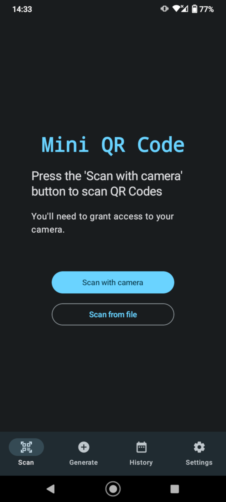
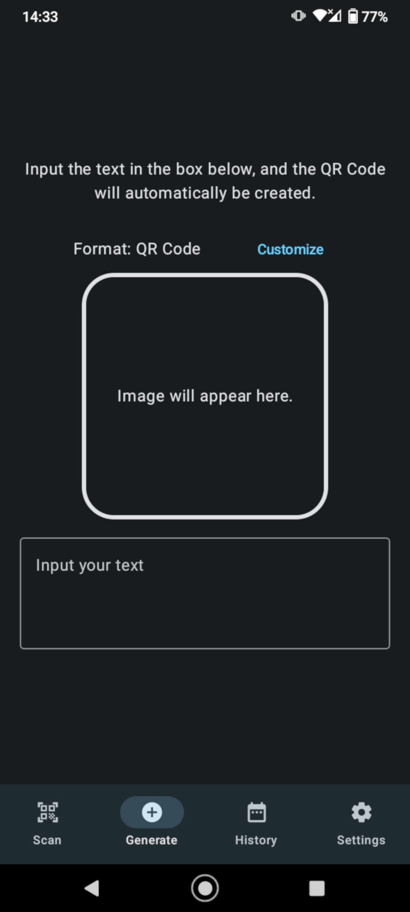
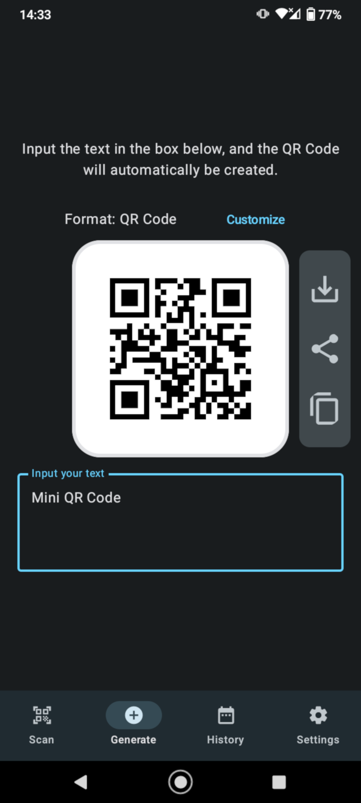
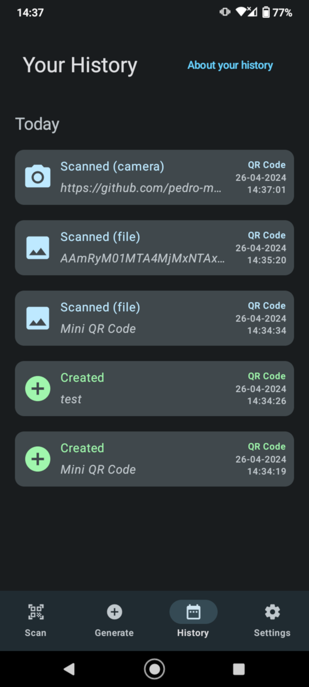

# Mini QR Code

## Aka QR Code X, or QR Code Compose X

<a href="https://github.com/pedro-mgb/qr_code_compose_x/releases">Alternatively, check the Releases page</a>

This repository contains the source code for the Mini QR Code Android app - Scan and generate QR Codes and various barcodes.

## Screenshots

               

## About the project

The app is available only for Android - A kotlin multiplatform migration may be done one day, but nothing planned as of yet.

Currently support languages are English and Portuguese.

App is built 100% with Kotlin, and UI with JetPack Compose. Also uses several other jetpack libraries, and a few third-party as well.

### For more info on app architecture, CI/CD, and the overall codebase see [Project structure](docs/project-structure.md)

## Contributing

Anyone is free to open issues of bugs and feature suggestions, and even create Pull Requests with implementation of said features / fixes, add app translations for other languages, etc.

However, Pull Requests will be reviewed by me, and given my limited free time, may take some time to address them.
